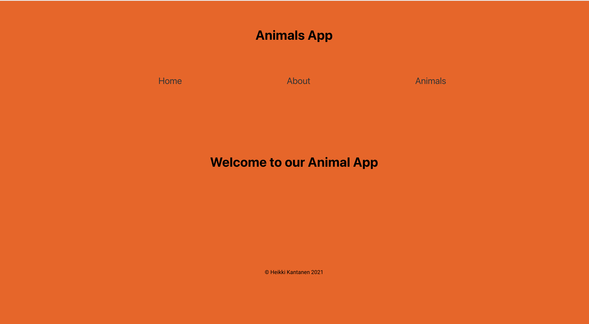
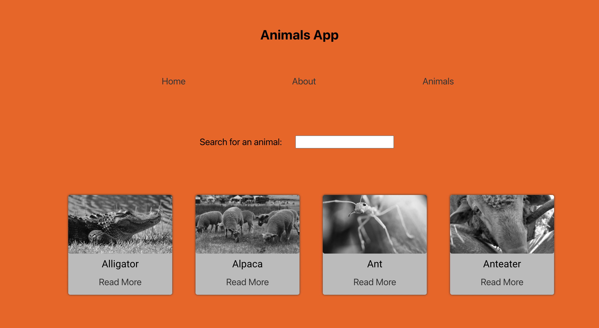
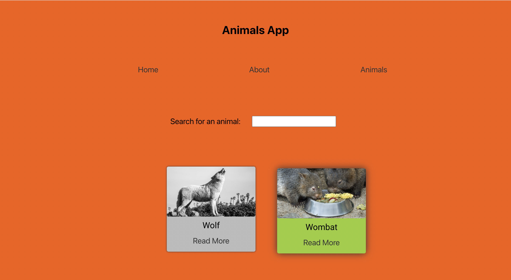
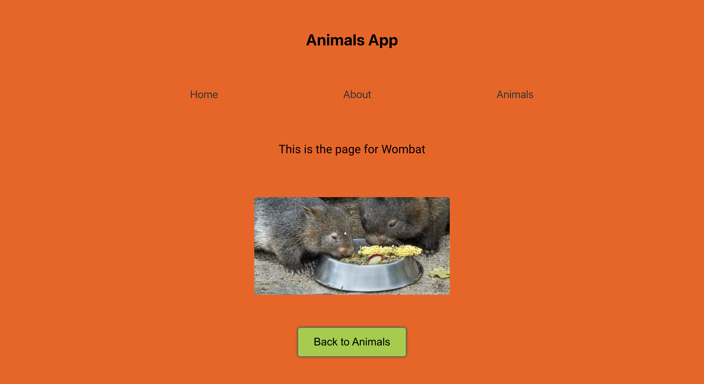

# Animals List App

## Description: 

An application developed with React.js for the Full Stack Web Development program in Business College Helsinki.

A React application that retrieves all the animals from a "local data file" and displays them in an alphabetical order.

Using React-Router-DOM to navigate the links.

In the application there's possible to search a spesific animal using the search bar. App then will show you the corresponding image of the animal you searched for.

The app takes you to an animals own page when you click the read more link of the image card.

## Application screenshots:

